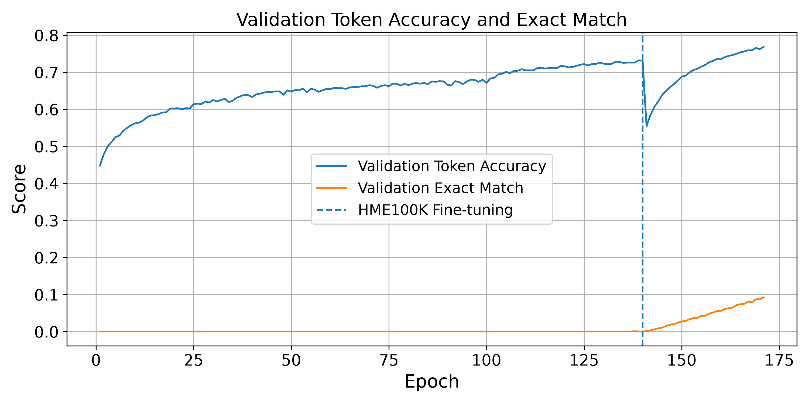

# Handwritten Mathematical Expression Recognition

An end-to-end deep-learning project that converts images of mathematical expressions into LaTeX. The project compares a CNN–RNN baseline with a ResNet–Transformer encoder–decoder model, then fine-tunes the primary model on handwritten expressions from HME100K.

> Developed for APS360: Applied Fundamentals of Deep Learning.



## Highlights

- Built an image-to-LaTeX pipeline that tokenizes mathematical notation, prepares image datasets, trains sequence models, and generates LaTeX predictions.
- Implemented a CNN–RNN baseline and a ResNet-152 visual encoder with a Transformer decoder for the primary model.
- Pretrained on Im2LaTeX-style rendered expressions and fine-tuned on handwritten HME100K samples to address the domain shift from typeset to handwritten math.
- Reached **76.85% validation token accuracy** and **9.26% validation exact match** after 170 epochs. These are validation metrics from the recorded training run; exact-match scoring is intentionally reported separately because a single token error invalidates an entire expression.

## Model overview

```text
Expression image
      |
ResNet-152 feature encoder + 2D positional encoding
      |
Transformer decoder (causal self-attention)
      |
LaTeX token sequence
```

The baseline uses a CNN encoder and RNN decoder. The primary model replaces the recurrent decoder with a Transformer decoder, allowing it to condition on the image features and previously generated tokens while predicting the next LaTeX token.

## Repository guide

```text
code/
├── data_process/                 # Cleaning, statistics, visualization, and tokenization
│   ├── im2latex/                 # Im2LaTeX preprocessing utilities
│   ├── hme/                      # HME100K preprocessing utilities
│   └── AIDA/                     # Exploratory preprocessing (not used in final training)
└── models/
    ├── baseline/                 # CNN–RNN baseline, training, and evaluation
    └── transformer/              # ResNet–Transformer model, training, inference, and evaluation
```

Key entry points:

- `code/models/transformer/train_only_im2.py` — pretrain the Transformer pipeline on Im2LaTeX data.
- `code/models/transformer/train_tuneon_hme100k.py` — fine-tune the pretrained model on HME100K.
- `code/models/transformer/test.py` — evaluate a Transformer checkpoint and report BLEU metrics.
- `code/models/transformer/inference_on_*.py` — run qualitative inference on supported datasets.
- `code/models/baseline/progress_trainbase.py` — train the CNN–RNN baseline.

## Setup

The original experiments used Python, PyTorch, and a CUDA-enabled GPU. Create an environment and install the project dependencies:

```bash
python -m venv .venv
# Windows
.venv\Scripts\activate
# macOS/Linux: source .venv/bin/activate
pip install -r requirements.txt
```

For CUDA acceleration, install the PyTorch and Torchvision builds appropriate for your system from [pytorch.org](https://pytorch.org/get-started/locally/) before running training.

## Data and checkpoints

Datasets and model weights are not included because the source data is approximately 40 GB and checkpoints are several hundred MB. The code expects the following processed assets:

- Im2LaTeX image folders and cleaned train/validation/test CSV files
- HME100K image folder plus `train.txt`, `val.txt`, and `test.txt` split files
- A tokenizer JSON file and, for fine-tuning or evaluation, a compatible checkpoint

Several course-project scripts contain paths specific to the original development machine (for example, `D:\\APS360_proj\\data\\...`). Before running an entry point, update its configuration constants near the top of the file to match your local data, tokenizer, and checkpoint locations.

## Reproducing the primary experiment

1. Prepare images and annotations with the scripts in `code/data_process/`.
2. Build a tokenizer with `code/data_process/tokenize_both.py`.
3. Configure and run `train_only_im2.py` to pretrain on rendered expressions.
4. Set the pretrained checkpoint and HME100K paths in `train_tuneon_hme100k.py`, then fine-tune.
5. Configure `test.py` with the target dataset and checkpoint to calculate BLEU scores or use an `inference_on_*.py` script for qualitative predictions.

## Results

The included figure shows validation metrics over 140 pretraining epochs followed by 30 HME100K fine-tuning epochs. The dashed line marks the transition to handwritten-data fine-tuning. Training logs and model weights remain local-only artifacts to keep the repository lightweight.

## Technical report

For a deeper technical discussion, see the [full project report](docs/report.pdf). It documents the ResNet–Transformer architecture, data-cleaning and tokenization pipeline, staged pretraining and fine-tuning procedure, baseline comparison, full test-set evaluation, qualitative examples, and error analysis. The README is intentionally a concise project overview; the report is the authoritative source for model specifications and experimental details.

## Notes

This repository preserves the original course-project experimentation workflow. It is presented as a portfolio artifact: paths and dataset preparation are documented, while large datasets, checkpoints, generated plots, and local environments are excluded from version control.
